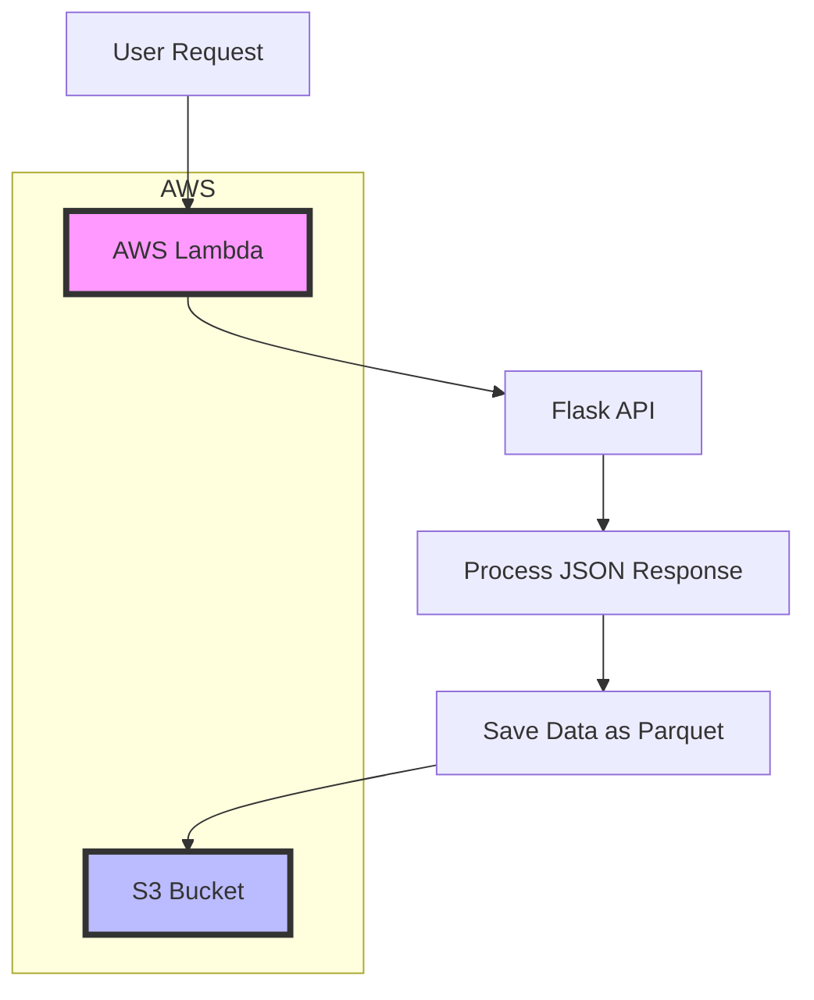

# Flask API and AWS S3 Integration

## Overview

This project demonstrates the integration of a **Flask API** that processes CSV data and a **Python script** that consumes the API, processes the JSON response, and stores the data in **AWS S3** as Parquet files. The API allows retrieval of agricultural data (such as production, processing, commercialization, etc.) in JSON format, and the AWS script stores the processed data on S3 for further use.

## Project Structure

```
├── app.py                 # Flask API to process CSV files and return JSON data
├── aws_bucket.py          # Python script to request API data and store it in S3 as Parquet files
├── README.md              # Project documentation
└── requirements.txt       # Python dependencies
```

## Architecture

The architecture of this project involves the interaction between a user, a Flask API, AWS Lambda, and AWS S3 storage. Below is the architecture diagram:



### Explanation: 

1. **User Request**: The user makes a request to the API, which is processed by an AWS Lambda function.
2. **Lambda Function**: The Lambda function makes the call to the Flask API, which is hosted externally, and retrieves data in JSON format.
3. **Flask API**: A Flask API collects CSV data, processes it, and returns a JSON response.
4. **JSON Processing**: The Lambda function transforms the JSON data into a pandas DataFrame and adds data information from the processing.
5. **Write to S3**: The processed data is saved as a Parquet file in S3.

## Technologies Used

- **Python**: Core language used for both API development and data processing.
- **Flask**: Microframework used to create the API (`app.py`).
- **Pandas**: Library used for data manipulation and conversion to Parquet format.
- **AWS S3**: Cloud storage service used to store the Parquet files.
- **Boto3**: AWS SDK for Python to interact with S3.
- **PyArrow**: Library used for converting Pandas DataFrames to Parquet format.

## Prerequisites

Before you can run the project, ensure you have the following installed:

- Python 3.8 or higher
- AWS CLI configured with access to S3
- Flask
- Pandas
- Boto3
- PyArrow

You can install the required dependencies using the `requirements.txt` file provided:

```bash
pip install -r requirements.txt
```

## Setting Up and Running the API

1. **Clone the repository** and navigate to the project folder.

2. **Run the Flask API**:
   - Edit the `app.py` file if needed and set the `url_base_csv` to the correct CSV data source.
   - Start the Flask server by running the following command:

   ```bash
   python app.py
   ```

   The API will be available at `http://localhost:5000`.

3. **Available Endpoints**:
   - `/producaoCSV`: Get production data.
   - `/processamentoCSV/tipo/<tipo>`: Get processing data by type (`Viniferas`, `Americanas`, etc.).
   - `/comercializacaoCSV`: Get commercialization data.
   - `/importacaoCSV/tipo/<tipo>`: Get import data by type (`Vinhos`, `Espumantes`, etc.).
   - `/exportacaoCSV/tipo/<tipo>`: Get export data by type (`Vinho`, `Espumantes`, etc.).

## Running the AWS Data Processing Script

1. **Edit AWS credentials**:
   Ensure your AWS credentials are set up correctly. You can configure your AWS CLI or use environment variables.

2. **Run the data processing script**:
   The `aws_bucket.py` script requests data from the Flask API, processes it, and stores it in an S3 bucket.

   - Set up the **S3 bucket name** and **file path** inside `aws_bucket.py`.
   - Modify the **API URL** in the `main()` function as necessary to match the locally running API.
   - Execute the script:

   ```bash
   python aws_bucket.py
   ```

   The script will:
   - Fetch data from the API.
   - Convert the JSON data into a Pandas DataFrame.
   - Add a processing date column to the data.
   - Save the data as a Parquet file in the specified S3 bucket.

## Logging and Error Handling

The `aws_bucket.py` script includes logging to track both successes and errors. Logs are stored locally and uploaded to AWS S3. 

### Log Details

- Successful API requests and data processing will be logged.
- Errors in fetching data or uploading to S3 will be captured and logged with details.

## Example of API JSON Response

```json
{
    "DERIVADOS": [
        {
            "1970": 14164329,
            "1971": 13280518
        }
    ],
    "PRODUCAO": [
        {
            "1970": 5000000,
            "1971": 5100000
        }
    ]
}
```

## Customization

### Modifying API Routes

You can add new routes or modify existing ones in the `app.py` file. The `get_data()` function can be adapted to fetch different types of CSV data and return it as JSON.

### Expanding AWS S3 Integration

In the `aws_bucket.py` script, you can customize the S3 bucket structure, including:
- Bucket names.
- File path conventions.
- Adding more metadata to your Parquet files.

## Contributing

Feel free to submit issues or fork the repository to contribute to the project. Make sure to create a new branch for your changes and submit a pull request when ready.

## Possible Machine Learning Applications Using This Architecture

The architecture you've set up—using a Flask API, AWS Lambda, and S3 for processing and storing data—can serve as a foundation for a variety of machine learning applications. Below are some potential use cases, along with how this data flow can be integrated into machine learning processes:

### 1. **Sales Forecasting**
- **Application**: As your API provides data on sales and inventory (e.g., the `comercializacaoCSV`, `ProducaoCSV`, `exportacaoCSV/tipo/<tipo>` and `importacaoCSV/tipo/<tipo>` endpoints), you could use this to predict future sales.
- **How It Fits**: AWS Lambda can process sales data in real-time, and S3 can store historical records. This stored data can be used to train models that forecast sales trends, which can help with demand planning and inventory management.
- **Machine Learning Algorithm**: Regression models, time series analysis, and ensemble methods like Random Forests or Gradient Boosting.

### 2. **Supply Chain Optimization**
- **Application**: Data related to production (e.g., from `producaoCSV`) can help optimize the supply chain by predicting demand, identifying bottlenecks, and improving delivery times.
- **How It Fits**: Data on production and logistics can be pre-processed by AWS Lambda and stored in S3 for machine learning models. These models can help optimize supply chain operations by predicting stock levels or recommending the best transport routes.
- **Machine Learning Algorithm**: Linear Programming for optimization or ML models for forecasting demand.

### Integrating Machine Learning into the Current Architecture

- **Data Collection**: The Flask API serves as the entry point for collecting real-time data from various sources (e.g., CSV files, sensor data, sales records).
- **Data Processing**: AWS Lambda is used to pre-process the incoming data, transforming it into a structured format suitable for machine learning (e.g., cleaning, feature engineering).
- **Storage**: AWS S3 is a scalable storage solution for training data, intermediate results, and model outputs.
- **Machine Learning Pipeline**: Once the data is in S3, it can be loaded into a machine learning framework (e.g., AWS SageMaker, or even local systems) to train models, evaluate performance, and deploy them for inference.

This architecture allows for real-time data ingestion, automated processing, and machine learning model training—all of which can be applied to various industries and use cases.

## License

This project is licensed under the MIT License. See the `LICENSE` file for more details.

### Steps Summary

1. **Overview**: Provides a general description of the project.
2. **Technologies**: Lists the technologies and libraries used.
3. **Prerequisites**: Describes dependencies and how to install them.
4. **Running the API**: Instructions on how to run the Flask API and what endpoints are available.
5. **AWS Script**: Explains how to run the `aws_bucket.py` script and save data to S3.
6. **Logging**: Details about logging functionality.
7. **Customization**: Instructions on modifying the API or AWS integration.
8. **Contributing**: Guidelines for contributions.
9. **License**: License information.

This should give a comprehensive understanding of the project and how to use the provided scripts.
